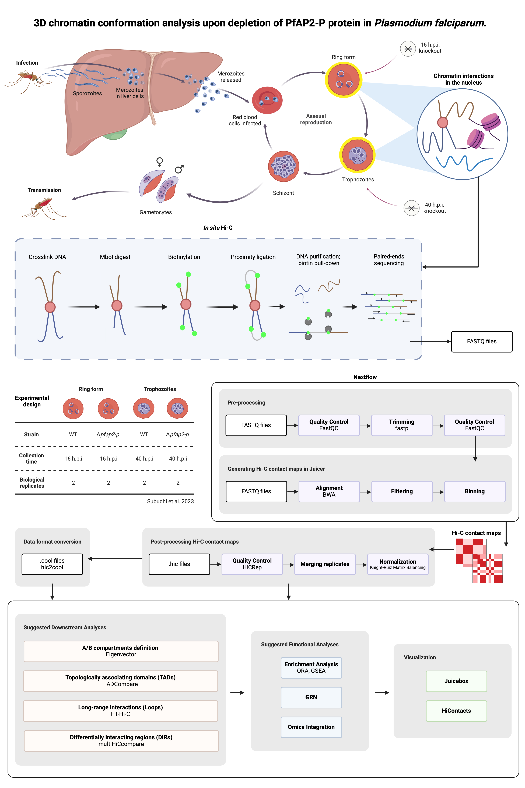

# Hi-C 
### 3D chromatin conformation analysis 
This repository provides a comprehensive Hi-C pipeline tailored for the analysis of *Plasmodium falciparum* genome.

### What is Hi-C?
The organization of chromatin within the eukaryotic cell nucleus is a highly dynamic and a complex system. Understanding how the three-dimensional (3D) chromatin architecture affects gene regulation, cell cycle progression and disease pathogenesis are important biological questions. To this date, there are many chromosome conformation capture (3C) technologies that are elucidating the 3D genome structure, including 4C, 5C and high-throughput chromatin conformation capture (Hi-C). The information provided by Hi-C can be grouped into three major spatial functional units: (a) large chromatin compartments (>1 Mb): transcriptionally active compartment A, and transcriptionally inactive compartment B; (b) medium-sized structures (100–1,000 kb), known as topologically associating domains (TADs); and (c) chromatin loops (~1–10 kb) that facilitate long-range interactions [1]. 

### Steps for Hi-C data analysis
1. Produce `.hic`  and `.mcool` files using our own [`HiCFlow`](https://github.com/Rohit-Satyam/HiCFlow/tree/main) Nextflow pipeline. The pipeline also provides the KR normalized per chromosome `*_eigen.txt` files. These can be used to visualize compartments in the data.
2. The `.hic` files can be imported in R and [`TADCompare`](https://github.com/dozmorovlab/TADCompare) package can be used for differential TAD analysis
3. Differential Loop Calling can be performed using [`FitHiC`](https://github.com/ay-lab/fithic)
4. Downstream Analysis Steps and Visualization are performed in R environment following the tutorials in this repository in order to flexibly adjust the analysis based on the biological question and data type. 

The Hi-C steps are shown below in a tree format:
```bash
Hi-C
  ├── Quality Control (FastQC version 0.12.1)
  ├── Trimming (fastp version 0.23.4)
  ├── Hi-C Data Pre-Processing  
  │   ├── Juicer version 1.6
  │     ├── Mapping (BWA version 0.7.17 or higher)
  │     ├── Detection of valid interaction products
  │     ├── Duplicates removal
  │     ├── Generate raw and normalized contact maps at various resolutions (KR)
  │     └── Compartments calling (Eigenvector)
  ├── Export to other contact maps formats (hic2cool version 0.8.3)
  ├── TADs calling (TADCompare version 1.12.1)
  ├── Loops calling (FitHiC version 1.28)
  ├── Differential Interactions (multiHiCcompare version 1.20.0)
  ├── Enrichment Analysis (topGO version 2.54.0)
  └── Vizualization (Juicebox version 2.3.0, HiContacts version 1.4.0)
```

### Case study


## Background
In this study, we focus on Hi-C application for understanding the nuclear architecture and gene regulation of the human malaria parasite, *Plasmodium falciparum*. The human infection starts when a female mosquito injects sporozoites into the host bloodstream during a blood meal. The injected sporozoites invade hepatocytes in the liver and undergo an extensive replication to release thousands of merozoites into the blood stream. The merozoites invade red blood cells where they begin a 48-hour replication cycle and develop asexually. During the 48-hour intra-erythrocytic developmental cycle (IDC) the parasite progresses through three distinct stages termed ring, trophozoite and schizont and later multiply into daughter cells by a process known as schizogony. These daughter parasites burst out of the host cell and invade new healthy erythrocytes [2]. 

## Biological Question
Here, we specifically characterize a Plasmodium-specific Apicomplexan AP2 transcription factor (PfAP2-P) essential during processes of the parasite development [3]. We explore the effects of PfAP2-P deletion on chromatin structure by whole-genome chromosome conformation capture (Hi-C) of wild type (WT) and knockout (KO) strains at 16 and 40 hours post invasion, which represent the ring and trophozoite stages respectively.

## Samples
Hi-C data: ENA BioProject accession no. [PRJNA847684](https://www.ncbi.nlm.nih.gov/bioproject/?term=PRJNA847684). 
Hi-C libraries were sequenced using the Illumina NovaSeq 6000 [4].

### References 
[1] Rao, S. S., Huntley, M. H., Durand, N. C., Stamenova, E. K., Bochkov, I. D., Robinson, J. T., Sanborn, A. L., Machol, I., Omer, A. D., Lander, E. S., & Aiden, E. L. (2014). A 3D map of the human genome at kilobase resolution reveals principles of chromatin looping. Cell, 159(7), 1665–1680. https://doi.org/10.1016/j.cell.2014.11.021

[2] Batugedara, G., & Le Roch, K. G. (2019). Unraveling the 3D genome of human malaria parasites. Seminars in cell & developmental biology, 90, 144–153. https://doi.org/10.1016/j.semcdb.2018.07.015

[3] Iwanaga, S., Kaneko, I., Kato, T., & Yuda, M. (2012). Identification of an AP2-family protein that is critical for malaria liver stage development. PloS one, 7(11), e47557. https://doi.org/10.1371/journal.pone.0047557

[4] Subudhi, A. K., Green, J. L., Satyam, R., Salunke, R. P., Lenz, T., Shuaib, M., Isaioglou, I., Abel, S., Gupta, M., Esau, L., Mourier, T., Nugmanova, R., Mfarrej, S., Shivapurkar, R., Stead, Z., Rached, F. B., Ostwal, Y., Sougrat, R., Dada, A., Kadamany, A. F., … Pain, A. (2023). DNA-binding protein PfAP2-P regulates parasite pathogenesis during malaria parasite blood stages. Nature microbiology, 8(11), 2154–2169. https://doi.org/10.1038/s41564-023-01497-6
