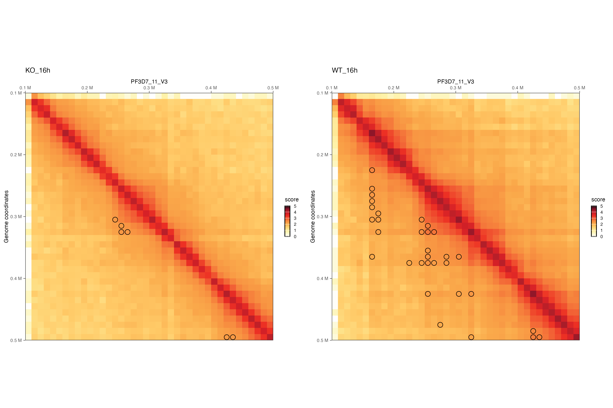

# Hi-C 
### Hi-C singificant interactions (loops)
Assigning statistical confidence estimates to intra-chromosomal contact maps produced by genome-wide genome conformation capture assays. This is incredibly important because not all of the contacts seen in the Hi-C data are truly unexpected interactions. By assigning statistical confidence to each interaction, you will be able to determine which interactions are the most important and consequently, which ones warrant further investigation.

#### 1. Load libraries
```
library(FitHiC)
library(HiContacts)
library(dplyr)
library(ggplot2)
library(purrr)
library(InteractionSet)

```

#### 2. Prepare the data
Prepare input files: INTERSFILE and FRAGSFILE. The INTERSFILE stores the information about interactions between fragment pairs. The FRAGSFILE stores the information about midpoints (or start indices) of all the fragments in the dataset. 
```
# Prepare metadata file
metadata <- as.data.frame(matrix(nrow = 8, ncol = 3))
colnames(metadata) <- c("strain", "h.p.i", "replicate")
rownames(metadata) <- list.files("/Users/kurowsaa/OneDrive/Documents/KAUST/BESE394E_homework/BESE394E_course/FINAL/hic-results")
metadata$strain <- c("KO", "KO", "WT", "WT", "KO", "KO", "WT", "WT")
metadata$h.p.i <- c(40, 40, 40, 40, 16, 16, 16, 16)
metadata$replicate <- c(2, 1, 2, 1, 2, 1, 2, 1)
metadata$ID <- paste0(metadata$strain, "_", metadata$h.p.i, "h_rep", metadata$replicate)

# list of sampels to analyze
samples.id <- rownames(metadata)

```

#### 3. Significant interactions
Cross-linking and digestion from a Hi-C assay produces a genome-wide contact map. First, we extract intra-chromosomal contacts. We fit an initial spline (spline-1) using the observed contact counts and genomic distances between all possible mid-range locus pairs. The general shape of the spline is assumed to be due to random polymer looping and is the basis for the initial null model. This initial spline determines a threshold to identify outliers (red dots) which are excluded from the calculation of a refined null represented by a second spline (spline-2). For each mid-range locus pair, we estimate the prior contact probability from spline-2 using the exact genomic distance between the loci in the pair. We calculate P-values for all contacts, including null and outlier pairs, by using a binomial distribution and apply multiple hypothesis testing correction to compute a Q-value for each P-value.

```
# Set a working directory
setwd("/Users/kurowsaa/OneDrive/Documents/KAUST/BESE394E_homework/BESE394E_course/FINAL/FitHiC/Input")

for( i in 1:length(samples.id)){
  fragsfile <- paste0("fragsfile.",samples.id[i],".bed.gz")
  intersfile <- paste0("intersfile.",samples.id[i],".bed.gz")
  outdir <- paste0("/Users/kurowsaa/OneDrive/Documents/KAUST/BESE394E_homework/BESE394E_course/FINAL/FitHiC/Results/",samples.id[i])
  FitHiC(fragsfile, intersfile, outdir, distUpThres = 5000000, distLowThres = 50000,
         libname=paste0(samples.id[i],".",metadata$ID[i]), noOfBins=100,
         visual=TRUE)
}
```

#### 5. Example of results for sample KO 16 h.p.i. rep2

Contact probablity based on the observed interactions distribution across the genomic distance. Total of 18777475 interactions. Majority of them at the distance < 1000 kb.


Outlires marked in red - to be removed based on the initial fit. 


Frequency of significant contacts filtered by the fdr < 0.05. We obtain a few hundred thousands of significant contacts across all of the chromosomes.


### 6. Ploting 
```
# Set a working directory
setwd("/Users/kurowsaa/OneDrive/Documents/KAUST/BESE394E_homework/BESE394E_course/FINAL/hic-results")

# Chromosome list
chr.list <- toupper(c("Pf3D7_01_v3","Pf3D7_02_v3","Pf3D7_03_v3","Pf3D7_04_v3","Pf3D7_05_v3","Pf3D7_06_v3","Pf3D7_07_v3","Pf3D7_08_v3","Pf3D7_09_v3","Pf3D7_10_v3","Pf3D7_11_v3","Pf3D7_12_v3","Pf3D7_13_v3","Pf3D7_14_v3"))

# Import Hi-C contact matrices
hics <- list()
for(i in 1:nrow(metadata)){
  hic <- import(paste0(rownames(metadata)[i],"/inter_30.mcool"), resolution = 10000)
  hics <- append(hics, hic)
}
names(hics) <- metadata$ID

# Get significant interactions info

for(i in 1:nrow(metadata)){
  sample <- rownames(metadata)[i]
  setwd(paste0("/Users/kurowsaa/OneDrive/Documents/KAUST/BESE394E_homework/BESE394E_course/FINAL/FitHiC/Results/",sample))

  fithic <- read.table(paste0(sample,".",metadata$ID[i],".spline_pass2.significances.txt.gz"), sep = "\t", header = T)
  fithic$start1 <- fithic$fragmentMid1 - 4999
  fithic$end1 <- fithic$fragmentMid1 + 5000
  fithic$start2 <- fithic$fragmentMid2 - 4999
  fithic$end2 <- fithic$fragmentMid2 + 5000

  cutoff <- quantile(fithic$contactCount, 0.90)
  fithic <- fithic[fithic$contactCount > cutoff,]
  
  # filter significant interactions fdr < 0.001
  fithic <- fithic[fithic$q_value < 0.001,]

  index.1 <- c(1,8,9)
  index.2 <- c(3,10,11)
  
  region.1 <- fithic[index.1]
  region.2 <- fithic[index.2]
  
  colnames(region.1) <- c("chr", "start", "end")
  colnames(region.2) <- c("chr", "start", "end")
  
  region.1 <- makeGRangesFromDataFrame(region.1)
  region.2 <- makeGRangesFromDataFrame(region.2)
  
  # Get interactions  
  gi <- GInteractions(region.1, region.2)
  gi$counts <- fithic$contactCount
  gi$qvalue <- fithic$q_value
  gi$pvalue <- fithic$p_value
  
  setwd("/Users/kurowsaa/OneDrive/Documents/KAUST/BESE394E_homework/BESE394E_course/FINAL/hic-results")
  topologicalFeatures(hics[[metadata$ID[i]]], "loops") <- gi # save loops to the hic object 
}

# Merge replicates for ploting chr 11
merged_replicates <- list(
  KO_16h = merge(hics[["KO_16h_rep2"]]["PF3D7_11_V3"], hics[["KO_16h_rep1"]]["PF3D7_11_V3"]),
  WT_16h = merge(hics[["WT_16h_rep2"]]["PF3D7_11_V3"], hics[["WT_16h_rep1"]]["PF3D7_11_V3"]))

# find overlaping loops between replicates 
rep2 <- topologicalFeatures(hics[["KO_16h_rep2"]], "loops")
rep1 <- topologicalFeatures(hics[["KO_16h_rep1"]], "loops")

loops_KO_16 <- subsetByOverlaps(rep1, rep2, type = "start", use.region="same")

# Zoom in to the region of interest
# save plots
setwd("/Users/kurowsaa/OneDrive/Documents/KAUST/BESE394E_homework/BESE394E_course/FINAL/hic-results")
toPlot_KO <- zoom(merged_replicates[["KO_16h"]], 10000) |> refocus('PF3D7_11_V3:100000-500000')
toPlot_WT <- zoom(merged_replicates[["WT_16h"]], 10000) |> refocus('PF3D7_11_V3:100000-500000')

p <- cowplot::plot_grid(
  plotMatrix(toPlot_KO, use.scores = 'balanced', loops = loops_KO_16, limits = c(0, 5), caption = FALSE) + ggtitle("KO_16h"),
  plotMatrix(toPlot_WT, use.scores = 'balanced', loops = loops_WT_16, limits = c(0, 5), caption = FALSE) + ggtitle("WT_16h"))

setwd("/Users/kurowsaa/OneDrive/Documents/KAUST/BESE394E_homework/BESE394E_course/FINAL/plots/loops")
ggsave(plot = p, filename = "chr11_KO_16_vs_WT_16.png", width = 12, height = 8, dpi = 300, units = "in")

```

We can observe a significant decrease of loops in a KO samples versus WT. Especially at the close proximity to the genomic locus of the Δpfap2-p gene. 


