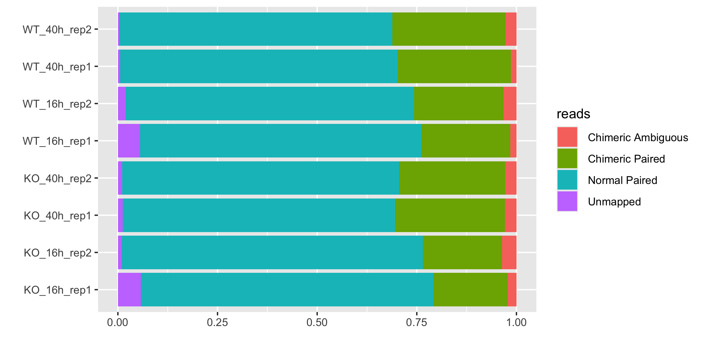
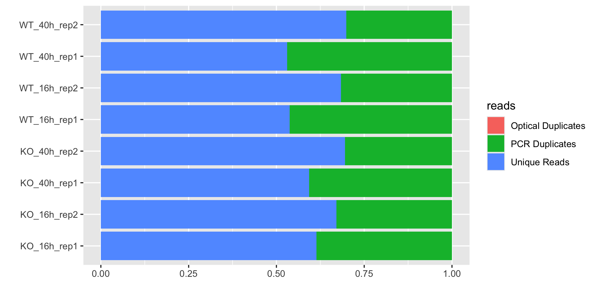
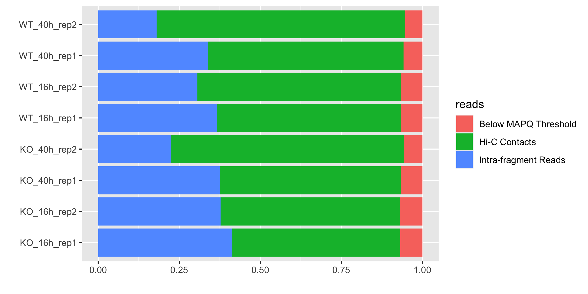
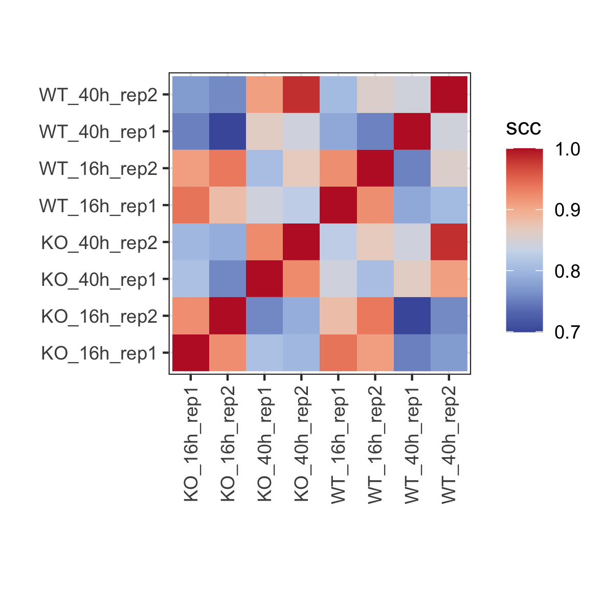

# Hi-C 
### Hi-C quality evaluation 
As data is processed using the Juicer pipeline, summary statistics are saved in the inter.txt and inter_30.txt files. This file provides a wide range of statistics. There are a few we would like to highlight as the most important for assessing an overall HiC data quality.

#### 1. Load libraries
```
library(ggplot2)
library(hicrep)
library(HiContacts)
library(purrr)
library(HiCExperiment)
library(reshape2)

```

#### 2. Load the data
```
# Set a working directory
setwd("/Users/kurowsaa/OneDrive/Documents/KAUST/BESE394E_homework/BESE394E_course/FINAL/hic-results")

# Prepare metadata file
metadata <- as.data.frame(matrix(nrow = 8, ncol = 3))
colnames(metadata) <- c("strain", "h.p.i", "replicate")
rownames(metadata) <- list.files("/Users/kurowsaa/OneDrive/Documents/KAUST/BESE394E_homework/BESE394E_course/FINAL/hic-results")
metadata$strain <- c("KO", "KO", "WT", "WT", "KO", "KO", "WT", "WT")
metadata$h.p.i <- c(40, 40, 40, 40, 16, 16, 16, 16)
metadata$replicate <- c(2, 1, 2, 1, 2, 1, 2, 1)
metadata$ID <- paste0(metadata$strain, "_", metadata$h.p.i, "h_rep", metadata$replicate)

samples <- rownames(metadata)

```

#### 3. Plot the stats 

## Valid Pairs 
Valid Pairs constitue of Normal Reads and Chimeric Reads. In a successful HiC experiment we expect to align more than 80% of all reads into valid reads for HiC analysis. In Normal Reads, both paired end reads map uniquely to the reference genome. In Chimeric Reads, both 5’ ends of a paired end read map to uniquely different locations in the reference genome, but at least one read requires a split in the alignment. An indication that the read overlaps the re-ligation junction.
```
stats <- data.frame() #subset relevant statistics 
for(i in 1:length(samples)){
  qc <- read.table(paste0(samples[i],"/qc.txt"), header = F, sep = "\t")
  toPlot <- as.data.frame(qc[2:5,1:2])
  toPlot$id <- metadata[i,]$ID
  stats <- rbind(stats, toPlot)
}
colnames(stats) <- c("reads", "value", "sample")

# plot
setwd("/Users/kurowsaa/OneDrive/Documents/KAUST/BESE394E_homework/BESE394E_course/FINAL/QC/Results")
png("Sequenced_reads_stats.png", width = 200, height = 100, units = "mm", res = 300)
ggplot(stats, aes(fill=reads, y=sample, x=value)) + 
  geom_bar(position="fill", stat="identity") +
  xlab("") + 
  ylab("")
dev.off()
```

In our data, more than 80% of reads are either Normal or Chimeric in all of the samples, which indicates high quality of the data. 

## Unique Pairs  
Within Valid Pairs we can distinguish those that map uniquely to the reference genome and those that are duplicated. The number of PCR duplicates is a function of the complexity of the library (how many unique molecules are estimated to be present in the amplified library) and the depth of sequencing. 
```
setwd("/Users/kurowsaa/OneDrive/Documents/KAUST/BESE394E_homework/BESE394E_course/FINAL/hic-results")
stats <- data.frame() #subset relevant statistics 
for(i in 1:length(samples)){
  qc <- read.table(paste0(samples[i],"/qc.txt"), header = F, sep = "\t")
  toPlot <- as.data.frame(qc[8:10,1:2])
  toPlot$id <- metadata[i,]$ID
  stats <- rbind(stats, toPlot)
}
colnames(stats) <- c("reads", "value", "sample")

# plot
setwd("/Users/kurowsaa/OneDrive/Documents/KAUST/BESE394E_homework/BESE394E_course/FINAL/QC/Results")
png("Valid_pairs_stats.png", width = 200, height = 100, units = "mm", res = 300)
ggplot(stats, aes(fill=reads, y=sample, x=value)) + 
  geom_bar(position="fill", stat="identity") +
  xlab("") + 
  ylab("")
dev.off()
```

In our data, approx. 60% of reads out of all Valid Pairs are uniquely mapping to the reference genome.

## Hi-C Contacts  
Within Unique Pairs we can finally identify Hi-C Contacts. This statistic provides the total number of reads that contributed to the final contact matrix in the Juicer pipeline. Often these reads are referred to as the “usable” reads since they make up the final analysis .hic file which is used for the identification of loops, TADs and A/B compartments.
```
setwd("/Users/kurowsaa/OneDrive/Documents/KAUST/BESE394E_homework/BESE394E_course/FINAL/hic-results")
stats <- data.frame() #subset relevant statistics 
for(i in 1:length(samples)){
  qc <- read.table(paste0(samples[i],"/qc.txt"), header = F, sep = "\t")
  toPlot <- as.data.frame(qc[16:17,1:2])
  toPlot$id <- metadata[i,]$ID
  stats <- rbind(stats, toPlot)
}
colnames(stats) <- c("reads", "value", "sample")

# plot
setwd("/Users/kurowsaa/OneDrive/Documents/KAUST/BESE394E_homework/BESE394E_course/FINAL/QC/Results")
png("Hi-C_stats.png", width = 200, height = 100, units = "mm", res = 300)
ggplot(stats, aes(fill=reads, y=sample, x=value)) + 
  geom_bar(position="fill", stat="identity") +
  xlab("") + 
  ylab("")
dev.off()
```

In our data Hi-C contacts are produced for approx. 50-60% of reads out of all Unique Pairs. The rest of the reads are excluded from final Hi-C matrix, i.e. reads with low quality (MAPQ < 30) as well as intra-fragment reads (occuring withing the same fragment).

### Hi-C reproducibility 
Hi-C data analysis and interpretation are still in their early stages. In particular, there has been a lack of sound statistical metric to evaluate the quality of Hi-C data. When two or more biological replicates are available, it is a common practice to compute correlation coefficients between the two Hi-C data matrices and use them as a metric for quality control. We adopt a stratum-adjusted correlation coefficient (SCC) as the measurement of Hi-C data reproducibility. The value of SCC ranges from -1 to 1, and it can be used to compare the degrees of differences in reproducibility.

#### 2. Load the data
```
# Set a working directory 
setwd("/Users/kurowsaa/OneDrive/Documents/KAUST/BESE394E_homework/BESE394E_course/FINAL/hic-results/")

# Chromosome list
chr.list <- toupper(c("Pf3D7_01_v3","Pf3D7_02_v3","Pf3D7_03_v3","Pf3D7_04_v3","Pf3D7_05_v3","Pf3D7_06_v3","Pf3D7_07_v3","Pf3D7_08_v3","Pf3D7_09_v3","Pf3D7_10_v3","Pf3D7_11_v3","Pf3D7_12_v3","Pf3D7_13_v3","Pf3D7_14_v3"))

# Import Hi-C contact matrices
hics <- list()
for(i in 1:nrow(metadata)){
  hic <- import(paste0(rownames(metadata)[i],"/inter.mcool"))
  hics <- append(hics, hic)
}
names(hics) <- metadata$ID
```

#### 2. Compute stratum-adjusted correlations between Hi-C datasets. 
“Stratum” refers to the distance from the main diagonal: with increase distance from the main diagonal, interactions of the DNA polymer are bound to decrease. Hicrep package computes a “per-stratum” correlation score and computes a weighted average correlation for entire chromosomes.
```
for(k in 1:length(chr.list)){
  chr <- chr.list[k]
  sc <- data.frame(matrix(NA, ncol=8, nrow=8))
  colnames(sc) <- metadata$ID
  rownames(sc) <- metadata$ID
  for(i in 1:length(hics)){
    for(j in 1:length(hics)){
      name1 <- names(hics)[i] #select sample 1
      name2 <- names(hics)[j] #select sample 2
      setwd("/Users/kurowsaa/OneDrive/Documents/KAUST/BESE394E_homework/BESE394E_course/FINAL/hic-results/")
      # Depending on matrix dimensions, compare them in different order. Workaround of https://github.com/TaoYang-dev/hicrep/issues/70
      mat1 <- hics[[name1]][chr] |> as.matrix(sparse = TRUE, use.scores = 'count') #extract matrix for sample 1 for chr k
      mat2 <- hics[[name2]][chr] |> as.matrix(sparse = TRUE, use.scores = 'count') #extract matrix for sample 2 for chr k
      if (nrow(mat1) > nrow(mat2)) {
        scc <- get.scc(mat2, mat1, resol = 10000, h = 2, lbr = 20000, ubr = 200000)$scc #calculate correlation
      } else {
        scc <- get.scc(mat1, mat2, resol = 10000, h = 2, lbr = 20000, ubr = 200000)$scc
      }
      sc[name1,name2] <- scc
    }
  }
  new_results <- setNames(melt(as.matrix(sc)), c('sample1', 'sample2', chr))
  setwd("/Users/kurowsaa/OneDrive/Documents/KAUST/BESE394E_homework/BESE394E_course/FINAL/QC/Results")
  write.table(new_results, sep = "\t", paste0(chr,"_scc.txt"))
}

# Find mean correlation value from all of the chromosomes
setwd("/Users/kurowsaa/OneDrive/Documents/KAUST/BESE394E_homework/BESE394E_course/FINAL/QC/Results")
scc.final <- data.frame(matrix(NA, nrow = nrow(metadata)*nrow(metadata), ncol = length(chr.list)))
colnames(scc.final) <- chr.list
for(i in 1:length(chr.list)){
  chr <- chr.list[i]
  scc.res <- read.table(paste0(chr.list[i],"_scc.txt"), sep = "\t")
  scc.final[,chr] <- scc.res[,chr]
}

scc.res$sample2==data$sample2
data <- as.data.frame(rowSums(scc.final)/length(chr.list))
colnames(data) <- "scc"
data$sample1 <- metadata$ID
data$sample2 <- c(rep(metadata$ID[1], 8), rep(metadata$ID[2], 8), rep(metadata$ID[3], 8), rep(metadata$ID[4], 8), 
                  rep(metadata$ID[5], 8), rep(metadata$ID[6], 8), rep(metadata$ID[7], 8), rep(metadata$ID[8], 8))

# plot
png("Stratum_correlation.png", width = 100, height = 100, units = "mm", res = 300)
ggplot(data, aes(x = sample1, y = sample2, fill = scc)) + 
  geom_tile() + 
  scale_x_discrete(guide = guide_axis(angle = 90)) + 
  theme_bw() + 
  coord_fixed(ratio = 1) + 
  xlab("") + ylab("") +
  scale_fill_gradientn(colours = bgrColors())
dev.off()
```

All biological replicates have the correlation coefficient > 90, except for WT samples at 16 h.p.i. with scc equal to ~ 85. 

