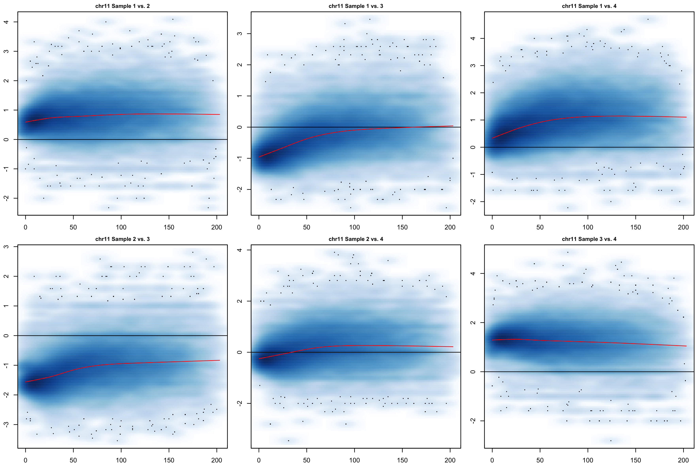
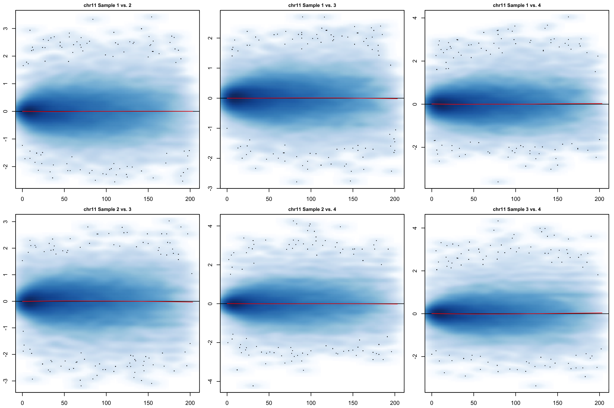
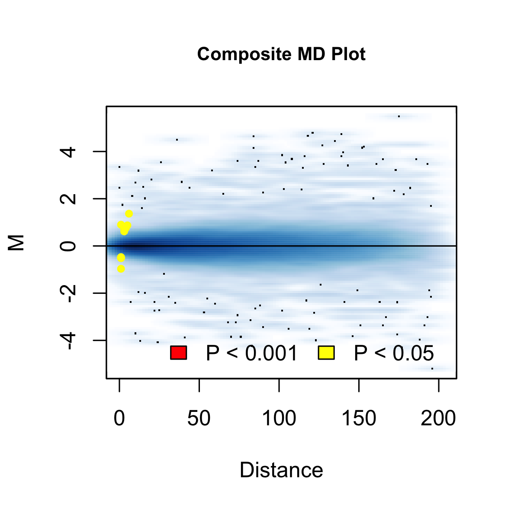
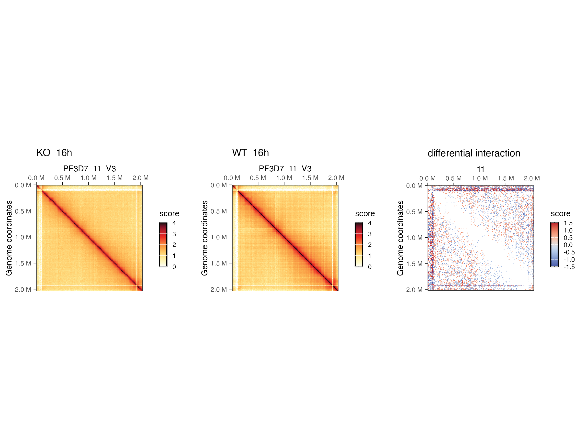

# Hi-C 
### Hi-C differentially interacting regions (DIRs) 
The joint normalization and removal of biases between multiple Hi-C datasets for comparative analysis and detection of differential chromatin interactions. 

#### 1. Load libraries
```
library(multiHiCcompare)
library(strawr)
library(edgeR)

```

#### 2. Load the data
```
# Set a working directory
setwd("/Users/kurowsaa/OneDrive/Documents/KAUST/BESE394E_homework/BESE394E_course/FINAL/hic-results")

# Prepare metadata file
metadata <- as.data.frame(matrix(nrow = 8, ncol = 3))
colnames(metadata) <- c("strain", "h.p.i", "replicate")
rownames(metadata) <- list.files("/Users/kurowsaa/OneDrive/Documents/KAUST/BESE394E_homework/BESE394E_course/FINAL/hic-results")
metadata$strain <- c("KO", "KO", "WT", "WT", "KO", "KO", "WT", "WT")
metadata$h.p.i <- c(40, 40, 40, 40, 16, 16, 16, 16)
metadata$replicate <- c(2, 1, 2, 1, 2, 1, 2, 1)
metadata$ID <- paste0(metadata$strain, "_", metadata$h.p.i, "h_rep", metadata$replicate)

# list of sampels to analyze
samples <- rownames(metadata)

```

#### 3. Extract Hi-C Raw Contact maps 
```
# Chromosomes list 

chr.list <- toupper(c("Pf3D7_01_v3","Pf3D7_02_v3","Pf3D7_03_v3","Pf3D7_04_v3","Pf3D7_05_v3","Pf3D7_06_v3","Pf3D7_07_v3","Pf3D7_08_v3","Pf3D7_09_v3","Pf3D7_10_v3","Pf3D7_11_v3","Pf3D7_12_v3","Pf3D7_13_v3","Pf3D7_14_v3"))

inter.list <- list() #create a list of all interactions per chr per sample
for(i in 1:length(samples)){
  sample.id <- samples[i] #define the sample id
  for(j in 1: length(chr.list)){
    chr <- as.character(chr.list[j]) #defined the chromosome for intra-chromosomal interactions 
    hic.file <- strawr::straw("NONE", paste0(sample.id,"/inter_30.hic"), chr, chr, "BP", 10000) #extract raw matrix, at 10k resolution 
    chr.name <- as.data.frame(rep(j, nrow(hic.file))) #add column with a chr name
    hic.file <- cbind(chr.name, hic.file)
    colnames(hic.file) <- c("chr", "region1", "region2", "IF") ## matrix ready to be input into multiHiCcompare
    newname <- paste0(sample.id,"_",chr)
    assign(newname, hic.file)
    hic.file <- list(hic.file)
    names(hic.file) <- newname
    
    inter.list <- append(inter.list, hic.file) # append to the list
  }
}

```
#### 4. Differential Interacting Regions 
In our dataset we have wild type (WT) and knockout (KO) samples. Each of the variants was sequenced in two biological replicates at two stages of parasite development: WT 16 h.p.i.; WT 40 h.p.i.; KO 16 h.p.i.; KO 40 h.p.i.

### KO_16 vs WT_16
```
# Set a results directory 
setwd("/Users/kurowsaa/OneDrive/Documents/KAUST/BESE394E_homework/BESE394E_course/FINAL/multiHiCcompare/Results/KO_16_vs_WT_16")

# all interactions per chr per samples

for(i in 1:length(chr.list)){
  # make groups & covariate input
  groups <- factor(metadata[metadata$group%in%c("KO_16", "WT_16"),]$strain)
  covariates <- data.frame(h.p.i = factor(metadata[metadata$group%in%c("KO_16", "WT_16"),]$h.p.i))
  # create hicexp object
  samples.id <- rownames(metadata[metadata$group%in%c("KO_16", "WT_16"),])
  data <- paste0(samples.id,"_",chr.list[i])
  hicexp <- make_hicexp(data_list = inter.list[data],
                        groups = groups, #covariates = covariates, #zero.p = 0, A.min = 5, 
                        filter = FALSE)
  
  # make MD plot before norm
  png(paste0(chr.list[i],".png"), width = 300, height = 200, units = "mm", res = 300)
  MD_hicexp(hicexp, prow = 2, pcol = 3, plot.loess = T)
  dev.off()
  
  # Library normalization FASTLO
  # Joint normalization algorithm for all of the samples
  hicexp <- fastlo(hicexp, verbose = FALSE, parallel = FALSE)
  
  # make MD plot
  png(paste0(chr.list[i],"_fastlo.png"), width = 300, height = 200, units = "mm", res = 300)
  MD_hicexp(hicexp, prow = 2, pcol = 3, plot.loess = T)
  dev.off()
  
  # Differentially Interacting Regions
  # GLM methods
  
  # Create design matrix
  design.matrix <- model.matrix(~ 0 + groups)
  colnames(design.matrix) <- gsub("groups", "", colnames(design.matrix))
  
  ## KO-WT in 16 h.p.i.
  # Specify contrasts
  contr <- makeContrasts(KO_16_vs_WT_16 = KO-WT, levels=colnames(design.matrix))
  
  hicexp <- hic_glm(hicexp, design = design.matrix, contrast = contr,
                    method = "QLFTest", p.method = "fdr", parallel = FALSE)
  
  # save results
  results <- results(hicexp)
  save(results, file = paste0(chr.list[i],".RData"))
  
  # Get top DIRs
  td <- topDirs(hicexp, logfc_cutoff = 0.58, logcpm_cutoff = 0.58, pval_aggregate = "max", p.adj_cutoff = 0.05, return_df = 'pairedbed')
  write.table(td, paste0(chr.list[i],"_DIRs.txt"), sep = "\t")
  
  # Plot a composite MD plot of the results of a comparison where the significant differences are highlighted.
  png(paste0(chr.list[i],"_composite.png"), width = 100, height = 100, units = "mm", res = 300)
  MD_composite(hicexp)
  dev.off()
}

```
### Results in chr11 in KO_16 vs WT_16 contrast 
## Pre-normalization joint plots 


## Post-normalization joint plots 


As can be seen in the above MD plots (showing the log-fold change and unit distance between interaction frequencies), the data for each sample has been jointly normalized with all other samples using the Fast Loess (Fastlo) joint normalization algorithm. The implementation of fastlo is adapted to Hi-C data on a per-distance basis. To perform “fastlo” on Hi-C data we first split the data into p pooled matrices. The “progressive pooling” is used to split up the Hi-C matrix by unit distance such that distance 0 is its own pool, distances 1 and 2 are pooled, distance 3, 4, 5 are pooled, and so on until all unit distances belong to one of p pools. 

## MD plots presenting significant DIRs

The plot shows where any significant differences are detected between the two groups. 

#### 5. Ploting
```
# Load libraries
library(HiContacts)
library(dplyr)
library(ggplot2)

# Plot log scale KO_16 vs WT_16 for differential interactions for chr 11

chr <- chr.list[11]

# get differential results

setwd("/Users/kurowsaa/OneDrive/Documents/KAUST/BESE394E_homework/BESE394E_course/FINAL/multiHiCcompare/Results/KO_16_vs_WT_16")
load(paste0(chr,".RData"))
hic_table <- results
  
# prepare data to plot
colnames(hic_table)[1:3] <- c("seqnames1", "start1", "start2")
gis <- hic_table |> 
    mutate(
      seqnames2 = seqnames1, 
      end1 = start1 + 9999, 
      end2 = start2 + 9999
    ) |> 
    filter(abs(logFC) >= 0.58) |> # filter interactions with FC lower that |1.5| between the groups
    df2gi() 

# extract hic matrix
setwd("/Users/kurowsaa/OneDrive/Documents/KAUST/BESE394E_homework/BESE394E_course/FINAL/hic-results")
merged_replicates <- list(
    KO_16h = merge(hics[["KO_16h_rep2"]][chr], hics[["KO_16h_rep1"]][chr]),
    WT_16h = merge(hics[["WT_16h_rep2"]][chr], hics[["WT_16h_rep1"]][chr]))
  
# save plots
setwd("/Users/kurowsaa/OneDrive/Documents/KAUST/BESE394E_homework/BESE394E_course/FINAL/plots/differential/KO_16_vs_WT_16")
p <- cowplot::plot_grid(
    plotMatrix(merged_replicates[['KO_16h']], use.scores = 'balanced', caption = FALSE, limits = c(0, 4)) + ggtitle("KO_16h"),
    plotMatrix(merged_replicates[['WT_16h']], use.scores = 'balanced', caption = FALSE, limits = c(0, 4)) + ggtitle("WT_16h"),
    plotMatrix(gis, use.scores = 'logFC', scale = 'linear', limits = c(-1.5, 1.5), cmap = bgrColors()) + ggtitle("differential interaction"), align = "hv", axis = 'tblr', nrow = 1)
ggsave(plot = p, filename = paste0(chr, "_KO_16_vs_WT_16.png"), width = 8, height = 6, dpi = 300, units = "in")

```

Chromatin contact heatmap of chromosome 11 at 16 h.p.i. for the Δpfap2-p (KO) and control (WT) parasites, as well as the fold change in interactions (third panels from left) between Δpfap2-p and control parasites. Blue indicates a loss of interactions and red indicates an increase of interactions of Δpfap2-p over control (WT).
