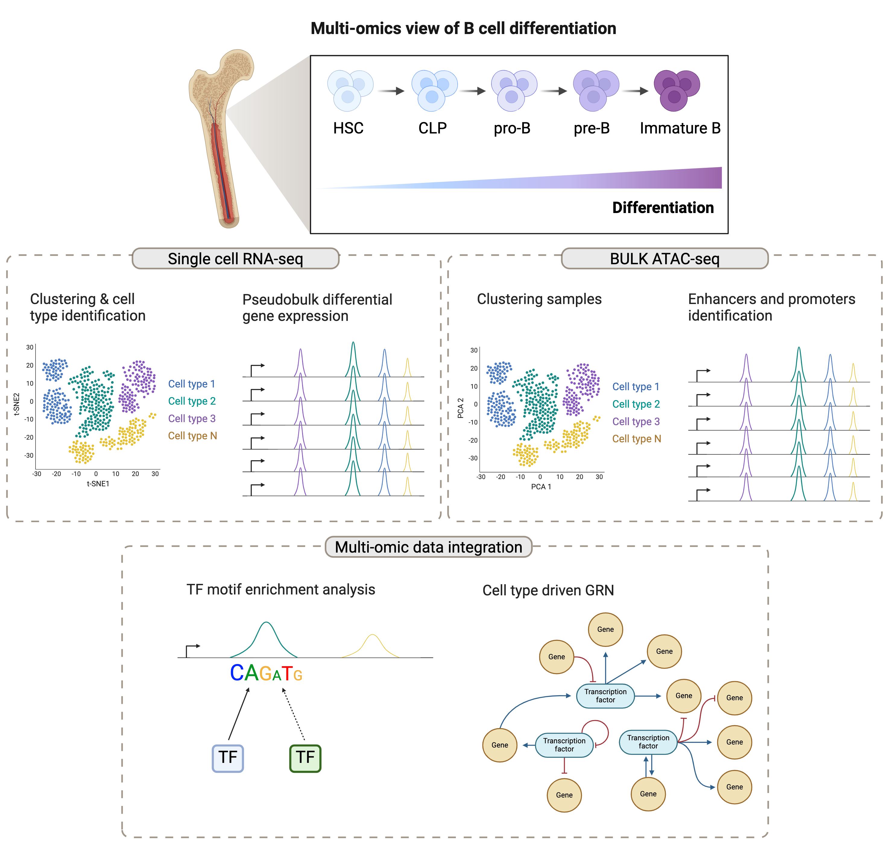

# W6 Integration
### Assignment Group 3:
This document presents an integrative analysis workflow of single-cell RNA-Seq (scRNA-Seq) and bulk Assay for Transposase-Accessible Chromatin using sequencing (ATAC-Seq) data to investigate B-cell differentiation.
Integrating scRNA-Seq and ATAC-Seq data is an exciting area of research, offering insights into the transcriptional regulation and gene expression profiles at a resolution unmatched by either method alone.

### Strategy 
Creating pseudo-bulk profiles from scRNA-Seq data enables the generation bulk-like samples based on cell types or clusters. Such aggregated transcriptomic data can then be directly compared with bulk ATAC-seq data to facilitate the identification of cell type-specific regulatory elements and their corresponding gene expression profiles. A potential downstream analysis step is to identify correlations between gene expression levels from scRNA-seq data and accessibility peaks from bulk ATAC-seq data. High correlation coefficients may indicate regulatory relationships, suggesting that accessible chromatin regions could regulate the expression of proximal genes.

### Challenges and Considerations
Data Resolution and Quality: The integration of single-cell and bulk data requires careful consideration of data resolution and quality differences. Single-cell data provides high-resolution insights, but can be noisy, whereas bulk data offers a more stable signal, but at a lower resolution.

## Dataset 
Public scRNA-Seq and bulk ATAC-seq data of B cell differentiation can be obtained from the European Genome-phenome Archive. 
Human data for transcriptome (scRNA-Seq) in CD34+ B cell precursors: EGAD00001010907.
Human data for chromatin accessibility (ATAC-Seq) in B-cell precursors: HSC, CLP, pro-B, pre-B, Immature B: EGAD00001010908. 

## Workflow
### Analysis design


### scRNA-seq
Analysis of `🔵scRNA-seq data` to investigate B-cell differentiation.
Goals:
1. Process the data according to standard a single-cell workflow.
2. Determine gene markers for each of the clusters.
3. Identify cell types of each cluster using the markers.
4. Determine whether there’s a need to re-cluster based on cell type markers, perhaps clusters need to be merged or split.

#### 1. Load libraries
```
library(Seurat)
library(ggplot2)
```

#### 3. Load the data
```
# Load 10x Genomics data using the Read10X function
data_matrix <- Read10X("./filtered_feature_bc_matrix")

# create a Seurat object containing the RNA data
sc_data <- CreateSeuratObject(counts = data_matrix, assay = "RNA"")
```

#### 4. Quality control
```
# Setting up various QC metrics for RNA data including mitochondrial gene percentage, ribosomal protein gene percentage, and ratio of features to UMIs
sc_data$mitoPct <- PercentageFeatureSet(sc_data, pattern = "^mt-")
sc_data$RPSPct  <- PercentageFeatureSet(object = sc_data, pattern = "^Rp[sl]")
sc_data$log10GenesPerUMI <- log10(sc_data$nFeature_RNA) / log10(sc_data$nCount_RNA)

# Plot quality control features before applying filters 

```

#### 5. Filtering and QC
```
# Filter cells based on quality metrics (e.g., number of detected genes, mitochondrial content)
sc_data <- subset(sc_data, subset = nFeature_RNA > 200 & nFeature_RNA < 2500 & percent.mt < 5)

# Plot quality control features after applying filters 

```

#### 6. Normalization and identification of highly variable features within the RNA assay
```
# Normalize gene expression measurements
sc_data <- NormalizeData(sc_data, normalization.method = "LogNormalize", scale.factor = 10000)

# Find and select highly variable genes for further analysis
sc_data <- FindVariableFeatures(sc_data, selection.method = "vst", nfeatures = 2000)
top10 <- head(VariableFeatures(sc_data), 10)
plot1 <- VariableFeaturePlot(sc_data)
plot2 <- LabelPoints(plot = plot1, points = top10, repel = TRUE)
CombinePlots(plots = list(plot1, plot2))
```

#### 7.  Scaling and Dimensionality Reduction
```
# Scale data, run PCA
sc_data <- ScaleData(sc_data, features = VariableFeatures(object = sc_data))
sc_data <- RunPCA(sc_data, features = VariableFeatures(object = sc_data))

# PCA plot
pca_plot <- DimPlot(sc_data, reduction = "pca")

# UMAP plot
sc_data <- RunUMAP(sc_data, dims = 1:10, reduction.name = "rna_umap")
umap_plot <- DimPlot(sc_data, reduction = "umap", label = TRUE, pt.size = 1)
```

#### 8. Clustering

```
# Find cell clusters 
sc_data <- FindNeighbors(sc_data, dims = 1:10)
sc_data <- FindClusters(sc_data, resolution = 0.5)

# UMAP plot colored by clusters

umap_cluster_plot <- DimPlot(sc_data, reduction = "umap", label = TRUE, pt.size = 1, group.by = "seurat_clusters")
```

#### 9. Assigning cell type identity to clusters
```
## Find markers for every cluster compared to all remaining cells, report only the positive ones
cluster_markers <- FindAllMarkers(sc_data, only.pos = TRUE, min.pct = 0.25, logfc.threshold = 0.25)

# Interpretation of the marker results
# When looking at the output, we suggest looking for marker genes with large differences in expression between pct.1 and pct.2 and larger fold changes. For instance if pct.1 = 0.90 and pct.2 = 0.80 and had lower log2 fold changes, that marker might not be as exciting. However, if pct.2 = 0.1 instead, then it would be a lot more exciting.

# When trying to understand the biology of the marker results it’s helpful to have the gene names instead of the Ensembl IDs, so we can merge our results with our annotations acquired previously:

# Merge gene annotations to marker results
cluster_markers  <- left_join(cluster_markers, 
                         annotations[, c(1:2, 3, 5)], 
                         by = c("gene" = "gene_id"))

# Rearrange order of columns to make clearer
cluster_markers <- cluster_markers [, c(6:8, 1:5, 9:10)]

# Explore the most significant markers for each cluster

# Return top 10 markers for cluster specified 'x'
gen_marker_table <- function(x){
  cluster_markers[cluster_markers$cluster == x, ] %>%
  head(n=10)
}

# Create a data frame of results for clusters 0-4
top10_markers <- map_dfr(0:4, gen_marker_table)


# Annotating clusters with cell types names
# Identify gene markers based on differential expression for each cluster

cluster_ids <- c(0, 1, 2, 3, 4)

# Annotating clusters with known cell types

# To get a better idea of cell type identity we can explore the expression of different identified markers by cluster using the FeaturePlot() function. For example, we can look at the cluster 3 markers by cluster:

# Visualization of top markers for each cluster
for (clust_id in cluster_ids){
  FeaturePlot(object = sc_data, features.plot = c(top10_markers[top10_markers$cluster == clust_id, "gene"]), 
  cols.use = c("grey", "blue"), 
  reduction.use = "tsne")
}

# These results and plots can help us determine the identity of these clusters or verify what we hypothesize the identity to be after exploring the canonical markers of expected cell types previously.

Sometimes the list of markers returned don’t sufficiently separate some of the clusters. For instance, we had previously identified clusters 0 and 1 , if we would like to determine the genes that are differentially expressed between these specific clusters, we can use the FindMarkers() function.

# Determine differentiating markers for CD4 T cell clusters 0 versus 1
markers_0vs1 <- FindMarkers(object = seurat, ident.1 = 0, ident.2 = 1)


# We can then reassign the identity of the clusters to these cell types:

# List of current cluster IDs
current_cluster_ids <- c(0, 1, 2, 3, 4,)

# List of new cluster IDs
new_cluster_ids <- c("HSC", "CLP", "pro-B", "pre-B", "Immature B")

# Changing IDs to cell type
sc_data@ident <- plyr::mapvalues(x = sc_data@ident, 
                                from = current_cluster_ids, 
                                to = new_cluster_ids)
# Re-run TSNE with cell types
TSNEPlot(object = sc_data, 
         do.label = TRUE, 
         pt.size = 0.5)
```

### bulk ATAC-seq
Analysis of `🟡ATAC data` to investigate B-cell differentiation. 
Goals:
1. Process the data according to a standard bulk ATAC-seq workflow.
2. Define consensus peaks for each cell type.
2. Determine transcription factors binding enrichment in each of the cell types.


# BULK ATAC
### 1. Peak Calling `MACS2`
```

macs2 callpeak \
--treatment "${input_file}" \
--name "${input_file%.bam}" \
--format BAMPE \
--nomodel \
--keep-dup all \
--qvalue 0.05 \
--outdir "path" \


```


### 2. Peak Consensus `R/GenomicRanges`
```

# bed files 
bed_files <- file.path(raw_data_folder, 
                       dir(raw_data_folder, pattern = '*.bed'))

# finding overlap between the files  -------------------------------\
wkg_bed_1 <- bed_1
wkg_bed_2 <- bed_2

hits <- findOverlaps(wkg_bed_1, wkg_bed_2)
# quantify the overlap
overlaps <- pintersect(wkg_bed_1[queryHits(hits)], wkg_bed_2[subjectHits(hits)])
overlaps
# overlap fraction with respect to the original peaks
percent_overlap_on_1 <- width(overlaps) / width(wkg_bed_1[queryHits(hits)])
percent_overlap_on_2 <- width(overlaps) / width(wkg_bed_2[subjectHits(hits)])

#### only when it is more than 0.3 i will keep it
hits <- hits[percent_overlap_on_1 > min_overlap & 
               percent_overlap_on_2 > min_overlap]

# subsetting the bed files
wkg_bed_1 <- wkg_bed_1[queryHits(hits)]
length(wkg_bed_1)
wkg_bed_2 <- wkg_bed_2[subjectHits(hits)]
length(wkg_bed_2)

# "reducing" the peaks
start_1 <- start(wkg_bed_1)
end_1 <- end(wkg_bed_1)
start_2 <- start(wkg_bed_2)
end_2 <- end(wkg_bed_2)

reduced_start <- pmin(start_1, start_2)
reduced_end <- pmax(end_1, end_2)
reference_bed <- wkg_bed_1
start(reference_bed) <- reduced_start
end(reference_bed) <- reduced_end
reference_bed
length(reference_bed)

```

### 3. Counts `featureCounts`

```

module load subread

featureCounts -p --countReadPairs -F SAF \
-a FILE.saf \
--fracOverlap 0.2 \
-o merged_peaks.counts \
BAM1.bam \
BAM2.bam \
...
```
### 4. Differential Accesibility `R/DESeq2`


```
# 1 load count matrix
count_matrix <- read.csv(counts_path)


# 2 Create DESeqDataSet object --------------------------------------------------------------------------
DESeq2 <- DESeqDataSetFromMatrix(countData = count_matrix,
                                           colData = Factors,
                                           design = ~ Factors) 


# 3 QC and Filtering  ---------------------------------------------------------------------------
# Keeping only rows with at least 10 reads
smallestGroupSize <- 3
keep <- rowSums(counts(DESeq2) >= 10) >= smallestGroupSize
DESeq2_F <- DESeq2[keep,]
nrow(DESeq2) ## 12564
nrow(DESeq2_F) ###12436


# 4 Factors  ---------------------------------------------------------------------------
DESeq2_F$Factors ## Levels: 
DESeq2_F$Factors <-  relevel(DESeq2_F$Factors, ref =ref_factor) ##

# 5 DA CCESIBILITY Run DESeq ---------------------------------------------------------------------------
DESeq2_F<- DESeq(DESeq2_F)
resultsNames(DESeq2_F) ##"Intercept"   "Factors_S3h.Mon_vs_S12h.Mon" "Factors_S6h.Mon_vs_S12h.Mon"

res_f1_d2 <- results(DESeq2_F, contrast = c("Factors", factor_1, factor_2))


## STEP 3.1.4: QC??

# How do visualize?
vsd <- vst(DESeq2_F, blind=FALSE)
rld <- rlog(DESeq2_F, blind=FALSE)
head(assay(vsd), 3)

# heatmap
library("pheatmap")
select <- order(rowMeans(counts(DESeq2_F,normalized=TRUE)),
                decreasing=TRUE)[1:20]
df <- as.data.frame(colData(DESeq2_F)[,c("Factors")])
colnames(df) <- "Factors"

pheatmap(assay(vsd)[select,], cluster_rows=FALSE, show_rownames=FALSE,
         cluster_cols=FALSE)

# PCA
plotPCA(vsd, intgroup=c("Factors"))
plotPCA(rld, intgroup=c("Factors"))


# 6 ANNOTATION ---------------------------------------------------------------------------
# loading the reference bed file
peaks <- import(peaks_path)

# creating the peak name
peaks$name <- paste0(seqnames(peaks), '_', start(peaks), '_', end(peaks))

# annotating
peakAnno <- annotatePeak(peaks, tssRegion=c(-3000, 3000),
                         TxDb=txdb, annoDb="org.Hs.eg.db")
peakAnno

# plotting
plotAnnoBar(peakAnno)
plotDistToTSS(peakAnno)

# selecting the differentially expressed peaks
sign_peaks <- peaks[peaks$name %in% rownames(res)[sign_idx]]

# annotation for significant peaks
signPeakAnno <- annotatePeak(sign_peaks, tssRegion=c(-3000, 3000),
                             TxDb=txdb, annoDb="org.Hs.eg.db")

# plotting
plotAnnoBar(signPeakAnno)
plotDistToTSS(signPeakAnno)
### why the sign_peaks are more in distal intergenic -> enhancers

anno_df <- as.data.frame(signPeakAnno)## convert to dataframe 
anno_df


```

### 5. Motif Analysis `HOMER`
```
module load HOMER
findMotifsGenome.pl diff_peaks.txt mm10 ~/motifsFILE -size given -nomotif
```

### Integration
`🟡🔵Integrated data`
Transformation of `🔵scRNA-seq data` to investigate B-cell differentiation in integrative settings. 
Goals:
1. Prepare aggregated `🔵scRNA-seq data` for pseudobulk differential expression analysis.
2. Utilize the DESeq2 tool to perform pseudobulk differential expression analysis on a specific cell type cluster.

Integration strategy for `🔵scRNA-seq data` and `🟡ATAC data` to facilitate the identification of cell type-specific regulatory elements and their corresponding gene expression profiles. Goals:
1. Correlation Analysis between gene expression levels from `🔵scRNA-seq data` and accessibility peaks from bulk `🟡ATAC data`. High correlation coefficients can suggest regulatory relationships where accessible chromatin regions potentially regulate the expression of nearby genes. 


