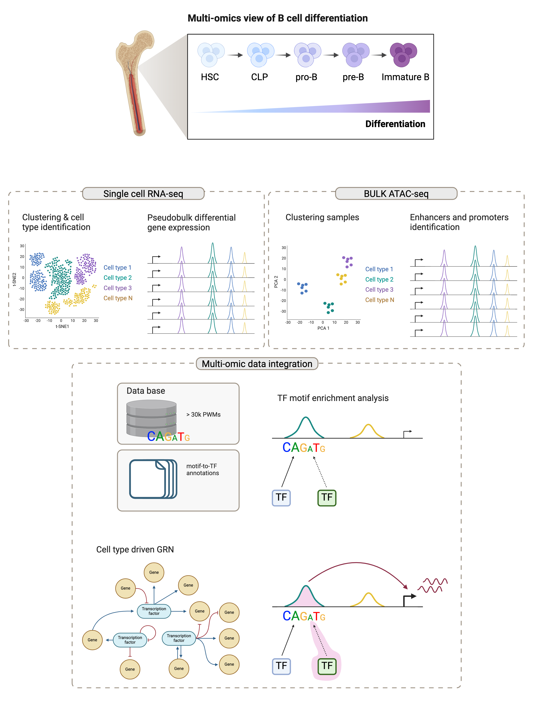

# W6 Integration
### Assignment Group 3:
This document presents an integrative analysis of single-cell RNA-Seq (scRNA-Seq) and bulk Assay for Transposase-Accessible Chromatin using sequencing (ATAC-Seq) data to investigate B-cell differentiation.
Integrating scRNA-Seq and ATAC-Seq data is an exciting area of research, offering insights into the transcriptional regulation and gene expression profiles at a resolution unmatched by either method alone.

### Strategy 
Creating pseudo-bulk profiles from scRNA-Seq data allows creating bulk-like samples based on cell type or cluster. This aggregated data can then be directly compared with bulk ATAC-seq data, facilitating the identification of cell type-specific regulatory elements and their corresponding gene expression profiles. One of the possible down-stream analysis steps involves identifying correlations between gene expression levels from transcriptomic and epigenetic data. High correlation coefficients can suggest regulatory relationships where accessible chromatin regions potentially regulate the expression of nearby genes.

### Challenges and Considerations
Data Resolution and Quality: The integration of single-cell and bulk data requires careful consideration of data resolution and quality differences. Single-cell data provides high-resolution insights, but can be noisy, whereas bulk data offers a more stable signal, but at a lower resolution.

## Dataset 
Public scRNA-Seq and bulk ATAC-seq data of B cell differentiation can be obtained from the European Genome-phenome Archive. 
Human data for transcriptome (scRNA-Seq) in CD34+ B cell precursors: EGAD00001010907.
Human data for chromatin accessibility (ATAC-Seq) in B-cell precursors: HSC, CLP, pro-B, pre-B, Immature B: EGAD00001010908. 

## Workflow
### Analysis design


### scRNA-seq
Analysis of `🔵scRNA-seq data` to investigate B-cell differentiation. 
Goals:
1. Process the data according to standard single-cell workflow.
2. Determine gene markers for each of the clusters.
3. Identify cell types of each cluster using the markers.
4. Determine whether there’s a need to re-cluster based on cell type markers, perhaps clusters need to be merged or split.

#### 1. Load libraries
```
library(Seurat)
library(ggplot2)
```

#### 3. Load the data
```
# Load 10x Genomics data using the Read10X function
data_matrix <- Read10X("./filtered_feature_bc_matrix")

# create a Seurat object containing the RNA data
sc_data <- CreateSeuratObject(counts = data_matrix, assay = "RNA"")
```

#### 4. Quality control
```
# Setting up various QC metrics for RNA data including mitochondrial gene percentage, ribosomal protein gene percentage, and ratio of features to UMIs
sc_data$mitoPct <- PercentageFeatureSet(sc_data, pattern = "^mt-")
sc_data$RPSPct  <- PercentageFeatureSet(object = sc_data, pattern = "^Rp[sl]")
sc_data$log10GenesPerUMI <- log10(sc_data$nFeature_RNA) / log10(sc_data$nCount_RNA)

# Plot quality control features before applying filters 

```

#### 5. Filtering and QC
```
# Filter cells based on quality metrics (e.g., number of detected genes, mitochondrial content)
sc_data <- subset(sc_data, subset = nFeature_RNA > 200 & nFeature_RNA < 2500 & percent.mt < 5)

# Plot quality control features after applying filters 

```

#### 6. Normalization and identification of highly variable features within the RNA assay
```
# Normalize gene expression measurements
sc_data <- NormalizeData(sc_data, normalization.method = "LogNormalize", scale.factor = 10000)

# Find and select highly variable genes for further analysis
sc_data <- FindVariableFeatures(sc_data, selection.method = "vst", nfeatures = 2000)
top10 <- head(VariableFeatures(sc_data), 10)
plot1 <- VariableFeaturePlot(sc_data)
plot2 <- LabelPoints(plot = plot1, points = top10, repel = TRUE)
CombinePlots(plots = list(plot1, plot2))
```

#### 7.  Scaling and Dimensionality Reduction
```
# Scale data, run PCA
sc_data <- ScaleData(sc_data, features = VariableFeatures(object = sc_data))
sc_data <- RunPCA(sc_data, features = VariableFeatures(object = sc_data))

# PCA plot
pca_plot <- DimPlot(sc_data, reduction = "pca")

# UMAP plot
sc_data <- RunUMAP(sc_data, dims = 1:10, reduction.name = "rna_umap")
umap_plot <- DimPlot(sc_data, reduction = "umap", label = TRUE, pt.size = 1)
```

#### 8. Clustering
Find clusters of cells
```
sc_data <- FindNeighbors(sc_data, dims = 1:10)
sc_data <- FindClusters(sc_data, resolution = 0.5)
```

UMAP plot colored by clusters
```
umap_cluster_plot <- DimPlot(sc_data, reduction = "umap", label = TRUE, pt.size = 1, group.by = "seurat_clusters")
```

#### 9. Differential Expression Analysis
Find markers for every cluster compared to all remaining cells. Report only the positive ones.
```
cluster_markers <- FindAllMarkers(sc_data, only.pos = TRUE, min.pct = 0.25, logfc.threshold = 0.25)
```

#### 10. Annotating Cell Types to each Clusters
Annotating clusters with known cell types
```
cluster_ids <- c("HSC" = 0, "CLP" = 1, "pre-B" = 2, "pro-B" = 3, "Immature.B" = 4)

# Annotating clusters with known cell types
for (cell_type in names(cluster_ids)){
  cluster_id <- cluster_ids[cell_type]
  Idents(sc_data) <- ifelse(Idents(sc_data) == cluster_id, cell_type, Idents(sc_data))
        }
        
sc_data <- SetIdent(sc_data, value = Idents(sc_data))

# Use a gene marker based on differential expression
marker_list <- list()
for (cell_type in names(cluster_ids)) {
  markers <- FindMarkers(sc_data, ident.1 = cell_type, min.pct = 0.25, logfc.threshold = 0.25)
  marker_list[[cell_type]] <- markers
}

## Visualization of top markers for each cell type
for (cell_type in names(marker_list)) {
  print(paste("Top markers for", cell_type, ":"))
  top_markers <- head(marker_list[[cell_type]], 5)
  print(top_markers)
  top_marker_gene <- rownames(top_markers)[1]
  FeaturePlot(sc_data, features = top_marker_gene) + ggtitle(paste("Top Marker for", cell_type))
}

selected_markers <- unique(unlist(lapply(marker_list, function(x) rownames(head(x, 3)))))
DotPlot(sc_data, features = selected_markers) + RotatedAxis()


### bulk ATAC-seq
Analysis of `🟡ATAC data` to investigate B-cell differentiation. 
Goals:
1. Process the data according to standard bulk ATAC-seq workflow.
2. Define consensus peaks for each cell type.
2. Determine transcription factors binding enrichment in each of the cell types.

### Integration
`🟡🔵Integrated data`


####


